# JavaScript Essentials Project
## Dive Quiz
### This quiz was built as a JavaScript essentials project as part of the diploma in software development at the code institute. This quiz is designed for academic purposes only and information is referenced from diving Ireland.

The quiz is a simple 12 question quiz with three categories of question included. It is designed to test very basic scuba knowledge. The languages and logic used to create the quiz are intended to display JavaScript skills.
 

### Lisa Butler

## **[Live Quiz] (https://lisa-butler.github.io/Dive-Quiz/)**

------------------------------------------------------------------

## **[Repository](https://github.com/lisa-butler/Dive-Quiz)**

------------------------------------------------------------------

## Contnets

 1. [User Experience](#ux)
 2. [Website Features](#features)   
 3. [Technology Used](#tech) 
 4. [Testing](#testing)  
 5. [Bugs](#bugs)  
 6. [Deployment](#deploy)
 7. [Credits](#credits)
 8. [Content](#content)  

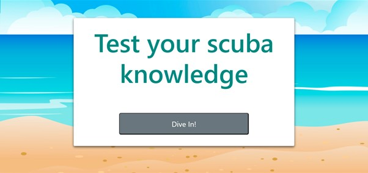

## User Experience 

### **Pre project planning** 
Before starting into this quiz, I explored the option of creating a game form the essentials project and ultimately decided to go with a quiz as this would enable me to use predominantly vanilla javascript and achieve the project goals without massively overstretching myself time wise. 
I chose to do a diving-based quiz as there is a lot of theory for new divers to learn, and a quiz would be a beneficial asset for learning it. The theory is usually split into the categories of general knowledge, physics and physiology, the categories I chose for my quiz. I hoped to create the quiz in such a way that it would let users know which areas they were stronger and which they were weaker on. As I was opting for three categories fo questions, I went with a 12 question quiz containing 4 questions from each category. For this project 30 questions, ten from each category, were added, however, there is scope to add many more.
Wires frames were developed for each page of the quiz and a general layout and functionality decided on before the development began. A weather app on the opening page before the quiz started was in the initial plans but later had to be left due to time constraints.

**Strategy:**
Determining the best approach meant investigating the needs of the potential users. This included the needs of the divers looking for a method to study diving theory.
**User stories:**
As a diver:
I want to be able to test my knowledge on basic scuba theory.
I want to be able to see what category I am stronger or weaker in.
I want to see my results displayed in a pleasing and easy to interpret manner.
I want to be able to reattempt the quiz.
I want an overall score.
I want a variation of questions each time.
I want to be able to navigate through the quiz easily.
I want to be able to do the quiz on my phone or tablet.

**Scope:**
The quiz should have a clear and consistent layout and be intuitive to work through.
The quiz should be accessible on all devices.
The diving questions should reflect those that are examined on and should be in these categories.
The diver should be able to see their strengths and weaknesses by category.
The results page should be easy to interpret.
There should be enough questions so that the diver can have different ones each time.

### **Structural planning**

**Start Page:**
The start page is a simple card with a suggestion to “test your scuba knowledge” and a button to click below that to initiate the quiz.
A background image was used throughout to add color to the quiz.

**Quiz Pages:**
Each page of the quiz consists of the question, a true or false button and a submit button. In order to click the submit button, the user must first have selected the rue or false button. 
A progress bar runs along the bottom and shows the user how far into the quiz they are.

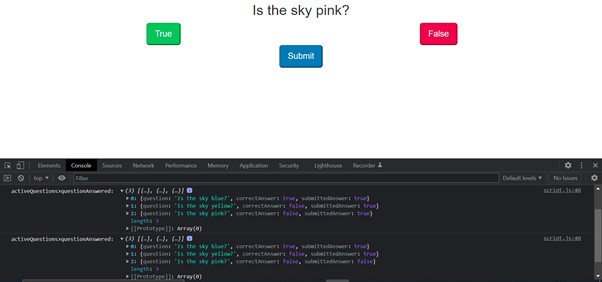

**Results Page:**
The results page has a general score at the top of the page. Below that it ha three categories of results displayed on a correct vs incorrect bar. This shows the user their skill level in each category.
At the bottom of the results page is a try again button to take the user back to the start page of the quiz.

**Wireframes:**
For this project i started with wire frames drawn on paper, these were then mocked up on a wrod docuemnt to form a basic idea of the proposed layout of the quiz pages.
The basic plan for the quiz was to keep it as simple and uncluttered as possible while creating an asthetically pleasing and enjoyable user experience. 

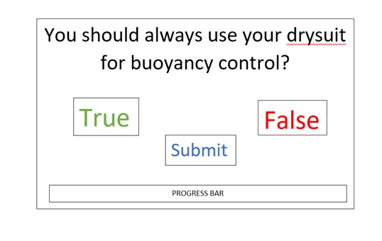

### **Style**

Background: It was decided to have a simple, brightly coloured background image in keeping with the scuba theme. This helped to push the card forward and make it more prominant on the screen while also contributing to the asthetics of the quiz site.

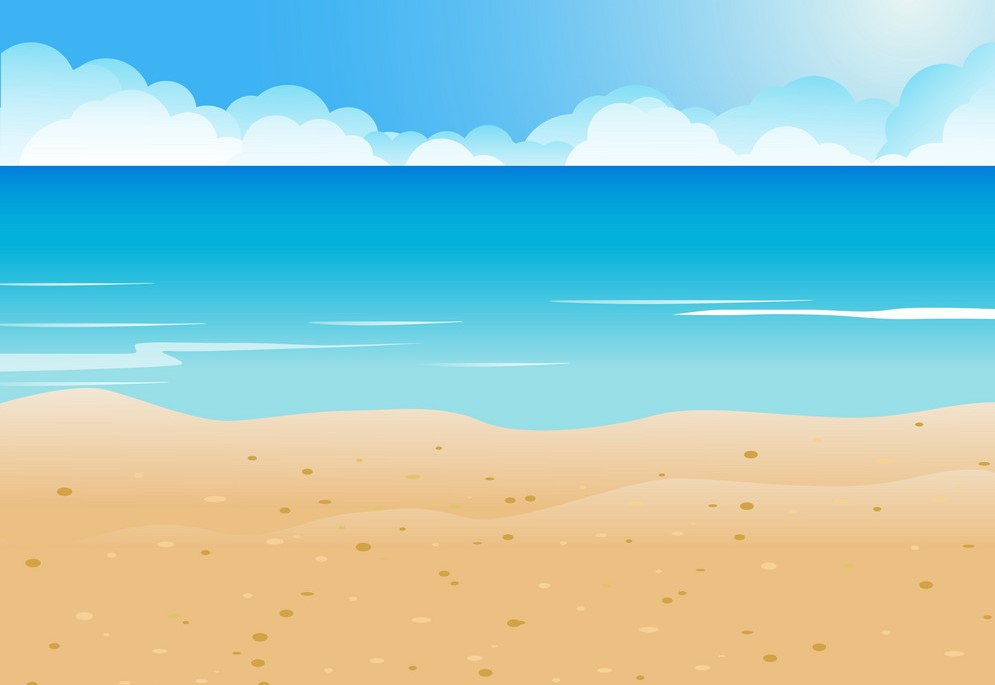

Card: The card option was chosen as it presented like study cards. With the shadow styling it could be made to look like a stack of notes. It also draws the viewers eye to the card and the info presented on it.

**Color:** 
The white card background was chosen as it allowed the question to stand out. By keeping the card a clean white against a colourful background it drew attention and made it easy for the user to read the question.

The colors that were selected for use were;

* White #FFF -used for the background of card.
* Grey #D3D3D3 -used for start quiz button.
* Teal #008080 -used for submit button as teal is a color associated with the sea.
* Blue #3f88db -used for the true button and selected with the dropper tool from the background image for cohesivness.
* Orange #d4a853 -used for the false button and selected with the dropper tool from the background image for cohesivness.

The blue of the progress bar was also selected with the dropper function and on the results page red and green were used to signify correct and incorrect.

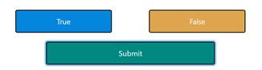

**Fonts:**
Fonts were selected based on what was clear and easy to read.

------------------------------------------------------------------

## Website Features

### **Start Page**

The start page of the quiz is a simple quiz card, designed to pull the users attention straight to it with a button to initiate the quiz being obvious.
On clicking this button, the questions are selected and randomised and populated as called.

**Dive in Button:**
The button was designed with bootstrap and a grey color was selected as this is in keeping with the diving theme.

### **Quiz Pages**

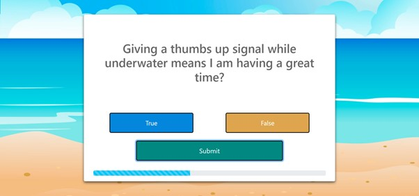

In order for the quiz to achieve its goals, it was decided to have three categories of questions (general, physics and physiology) within the question bank and to randomly pull 4 questions from each to become the active questions in the quiz. These questions are randomly selected on the click of the quiz initiating button. 

**True/False Buttons:**
A true button and a false button were used to answer the quiz. It was decided to make all questions true or false due to the small time frame that the quiz needed to be completed in. The user must select the true or false button before hitting submit as submit cannot be hit if the user hasn’t selected an answer. These buttons are different colors to indicate true and false as well as labelled and they change color when clicked on to indicate they have been selected.

**Submit Button:**
The submit button is a different color to the true false buttons and is positioned central in the quiz card. It cannot be pressed uness an answer has been selected. When the user hits submit, their answer is saved and the next question populates. 

**Progress Bar:**
The progress bar is a bootstrap feature that serves to indicate the users position in the quiz. Each question submitted will move the progress bar along.

### **Results Page**

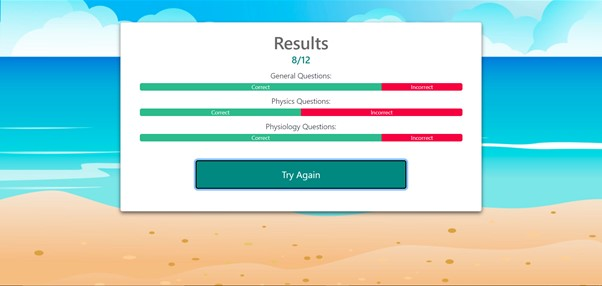

The results page displays the overall score then shows three seperate bars indicating the three cateories of questions results.

**Categorised Results**
The results are then separated into their three categories of general knowledge, physiology and physics and a bar is used to show their correct answers vs incorrect answers. This enables a divee to see where their knowledge is weakest.

**Try Again Button**
This button is at the bottom of the screen and takes the user back to the start page.

**Further features I would implement:**

If I was to build this quiz with more time and scope I would implement some different features.

* I would have a database for questions, outside of the main .js file. This would have close to 80 questions for this grade and would allow for more variance in the questions as well as the ability to cover more theory.
* I would also have other grades of diving questions, so that the user could select if they wanted to practise trainee diver, club diver, leading diver, rescue diver etc questions.
* I would implement a local storage option so that the user could review their progress by looking through their previous attempts.
* The option to review questions and see which specific questions were answered right and wrong would be useful.
* Having learning material for each category available on the main page would be helpful for users who are consistently getting questions wrong to go back and refresh their knowledge.
* I would also like to add different quiz options so the user could configure how many questions they would like per quiz, the specific category and select a timed mode or other modes of studying.

------------------------------------------------------------------

## Technologies Used 

### **Languages** 

The languages used in this project were;

* HTML5
* CSS3
* JavaScript

### **Frameworks/Libraries/programs:**

* GitHub: Used to store the project and to deploy the finished project.
* Fork: This was used as a local place to push code to and to pull from the Git repository.
* Brackets text editor: This was used to write the code locally.
* Bootstrap: This was used to provide the structure and functionality for the quiz.

------------------------------------------------------------------

## Troubleshooting and testing

### **Troubleshooting:**
Troubleshooting took less time in this project as i took the time to develop wireframes and knew the direction i wanted the project to go in. Needless to say, there were issues involving positining on screen and getting to grips with bootstrap but only minor issues. 

### **Testing:**
Testing was mostly done by me and some friends, three of which are software developers, to determine the usability and functionality of the site.

**Testing links and forms:**
    
* The initial “Dive in” button on the home screen starts the quiz and takes the user to the first question. Yes.
* The questions all populate and can be seen in dev tools. Yes.
* The questions are randomised and from 3 different categories. Yes.
* The progress bar moves along the correct amount for each question answered. Yes.
* The submit button saves the answer. Yes.
* Answers are compared to the correct answer and scored appropriately. Yes.
* The user cannot hit submit without selecting an answer. Yes.
* The progress bar disappears on the results page. Yes.
* The results are displayed correctly in the bars. Yes.
* The “Try again” button takes the user to the home page again.
* All buttons are legible and functional. Yes.

    
**Testing other elements:** 
    
* Quiz navigation was intuitive. Yes.
* The background image did not obscure the usability. Yes.

**Testing using Google Lighthouse:**

Testing with Lighthouse was straightforward and did not raise any significant issues.

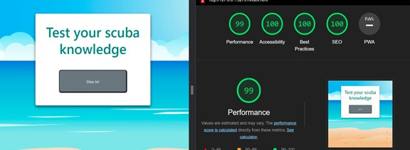

**Testing using W3C Validator:**

Testing with W3C Validator came back with no errors or warnings. 

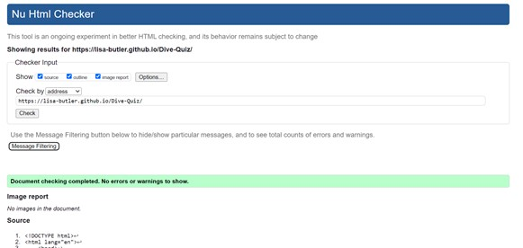

**Testing using Jigsaw:**

Testing with CSS Jigsaw validator showed no errors.

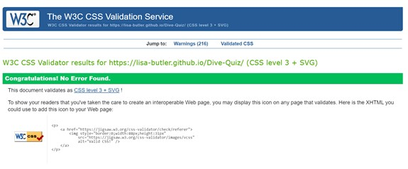

**Testing using W3C jsHint:**

Testing with jsHint showed 47 warnings. These were all pertaining to the version of javascript that was being used, suggesting that version 6 needs to be run for these functions to work effectively. As i used version 6 to write the code and some research showed that this will vary device to device, i did not pursue this issue.

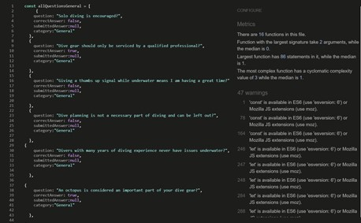

## Bugs

### **Bugs Found:**

* Initially there was an issue with the progress bar, it did not progress as each question was clicked, then it was finishing its count on the results page and was still present on this page. All were resolved.
* Positioning on the screen especially on smaller screens was somewhat difficult. The submit button would disappear off the screen making it impossible to progress the quiz. The buttons would also stack over the text. This was remedied with media queries and altering sizing.

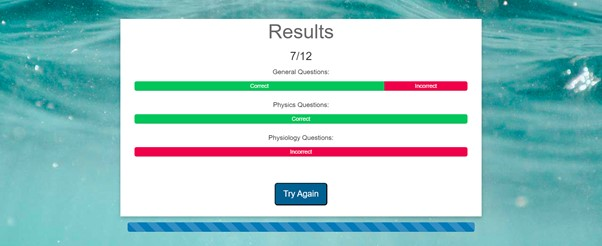

------------------------------------------------------------------

## Deployment

Deployment of the quiz via github was done using the following steps;
* After logging into GitHub I located my repository for the Dive Quiz. 
* I then clicked the "Settings" button at the top of my repository
* I found and clicked on the Pages tab on the left of the screen.
* On this page under "Source" option I clicked the dropdown called "None" and select "Master Branch".
* The page automatically refreshed.
* I was told that my quiz was deploying, and a link was displayed. After about a minute and a refresh there was a tick present next to the link and my quiz was deployed and live.

------------------------------------------------------------------

## Credits and Acknowledgements

### **Credits:**

* Background Image: VectorStock.com.
* Code: Some code snippets were taken and adjusted for purpose from W3Schools (https://www.w3schools.com/), Stack Overflow (https://www.w3schools.com/) and FreeCodeCamp (https://www.freecodecamp.org/).
* BootStrap: Bootstrap code such as that for the progress bars and buttons was taken and adjusted from getBootStrap.com (https://getbootstrap.com/).

### **Acknowledgements:** 

* My program coordinator Kasia for contiuned support and advice throughout.
* My software developer friends (Joshua Butler-senior dev at Overstock Ireland and Glenn Gilmartin- senior dev at Overstock Ireland) for their advice and patience.

------------------------------------------------------------------

## Content and resources

* All content was written by the developer as part of an academic exercise for the Code Institute.
